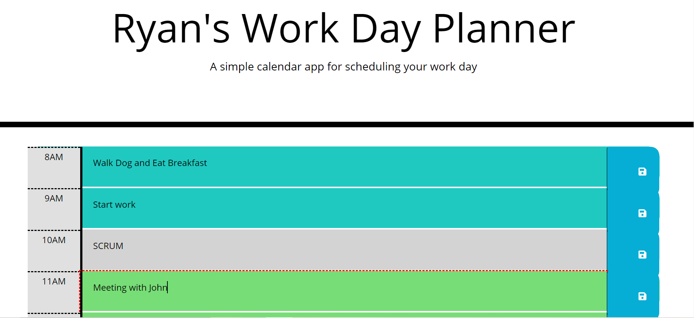

# <WorkDay!>

Need help with your daily schedule? This new app is created to help guide your daily schedule in color!
Input any of your daily tasks and save them and change them at any moment. You can shade out the hours that are not work/schedule regulated. Great way to ditch the cheap calendar or planner and get organized.

## Description

Provide a short description explaining the what, why, and how of your project. Use the following questions as a guide:

- As a busy person with a ever changing schedule, I need an app to keep me up to date.
- I want to be able to add daily and important tasks/events to planner.
- This will help me manage my time more effectively and give me more time to focus on tasks.

## Installation

What are the steps required to install your project? Clone a copy of this repository from Github to get started!

## Features

An easy user experience that is intuitive and stylish! This application will be continually updated.

## Tests

This has been tested on W3C markup validator and no errors or warnings to show.

## ScreenShot

## Credits

Ryan Anderson
